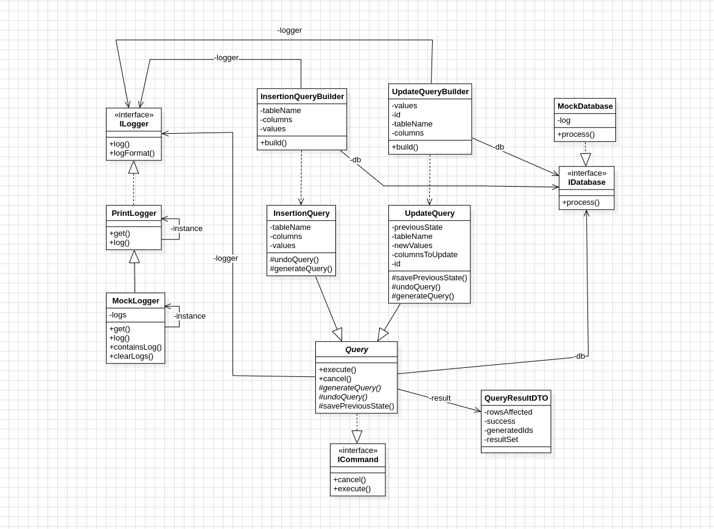

# LP5_Command

Este projeto visa implementar o padrão **Command** (e no processo, alguns outros). Para isso, foi codificado um montador de query em SQL, recebendo como entrada informações como o nome da tabela, colunas e dados a serem alterados, etc. 

Desta forma, podemos observar o padrão Command na estrutura do Query em si. Este herda uma interface onde são declarados dois métodos: _execute_ e _cancel_. Com esse métodos, a classe abstrata Query define como os métodos execute e cancel controlarão a execução da query, bem como o ato de desfazê-la. As classes que a herdarem devem determinar como essa query será montada, de acordo com o seu próprio contexto.

Também foram implementados alguns outros padrões:

- **Builder**: Foi usado para a montagem de cada Query de acordo com o seu Builder, garantindo que seja válida antes da execução.
- **Template Method** Foi usado onde a classe Query abstrai a montagem específica de cada tipo de query para suas subclasses.
- **Singleton**: As classes de Log são singletons, garantindo que haja sempre uma única instância de cada tipo de logger.

## Diagrama de Classe

